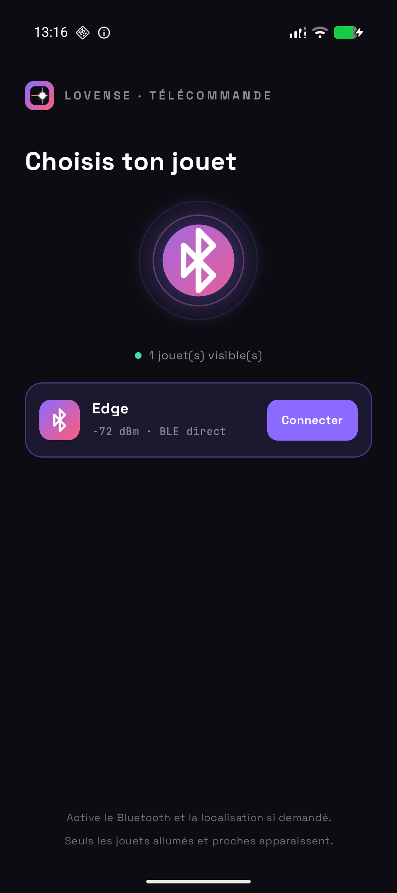
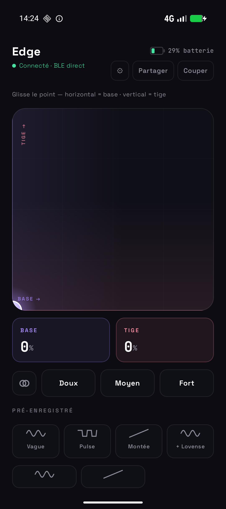
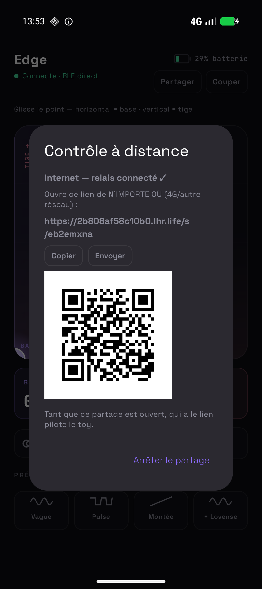

<div align="center">


# Lovense Remote

**Pilote tes toys en Bluetooth direct — sans app, sans compte, sans cloud.**

Télécommande Android open source. Plusieurs toys en même temps, plusieurs marques, l'interface s'adapte à chacun.

[English](README.md) · **Français**

&nbsp;
&nbsp;


</div>

> ⚠️ Projet communautaire expérimental. **Non affilié à Lovense.**
>
> 🤖 **Vibe codé** — cette app a été écrite en grande partie avec un assistant de
> code IA, puis relue et testée à la main. Lis le code (et la section Sécurité)
> avant de lui confier quoi que ce soit d'important.

---

## ✨ Fonctionnalités

- **🔵 BLE direct** — scan, connexion et pilotage depuis ton téléphone.
- **🧸 Plusieurs toys à la fois** — jusqu'à 5 toys, pilotés un par un ou **tous**
  ensemble ; patterns, presets et contrôle à distance suivent la cible choisie.
- **🏷 800+ modèles, 120+ marques** — Lovense (testé) et, en **expérimental**,
  Satisfyer, We-Vibe, Svakom, Lelo, Kiiroo, Magic Motion, JoyHub, Galaku, Hismith,
  Vorze, Foreo, Sistalk et bien d'autres — voir la
  [**liste complète des toys pris en charge**](docs/SUPPORTED_TOYS.md) (en anglais).
- **🎚 Interface adaptée à chaque toy** — un contrôle par actionneur, construit
  depuis la base d'appareils : vibration (un ou plusieurs moteurs), rotation avec
  inversion du sens, va-et-vient, succion / pompe, **chauffe** (on/off ou °C),
  **lumières**, **pompe à lubrifiant** (bouton *Spray* momentané) et **strokers**
  (l'app génère les mouvements). Niveau de batterie quand le toy le fournit.
- **👍 Pad XY à une main** — un pouce pilote les deux moteurs des toys à deux moteurs.
- **🎛 Patterns** — intégrés, import Lovense `.ta`, mode **Tease** aléatoire et
  mode **enregistrement** (joue → pattern sauvegardé).
- **🔗 Contrôle à distance par lien** — un·e partenaire pilote tes toys depuis le
  **même Wi-Fi** ou **par internet / 4G**, protégé par un lien secret, un **PIN à
  6 chiffres**, ton accord **pour chaque contrôleur** et une expiration automatique.
- **🌙 Arrière-plan** — la liaison reste active app fermée, plus une tuile **STOP**
  dans les réglages rapides.
- **🌍 Langues & thèmes** — anglais (par défaut) / français / espagnol, sombre & clair.
- **🟢 100 % AOSP** — sans Google Play Services (compatible GrapheneOS).

## 🧸 Toys pris en charge

**803 modèles** dans **127 familles de marques** — la liste complète, générée
automatiquement, est dans [`docs/SUPPORTED_TOYS.md`](docs/SUPPORTED_TOYS.md)
(à régénérer avec `python3 tools/gen_supported.py`).

| | Marques (modèles) |
|---|---|
| ✅ Testé | **Lovense** (36) : Lush, Hush, Edge, Nora, Max, Domi, Ferri, Gemini, Gravity, Solace, Flexer, Tenera, Calor… |
| 🧪 Expérimental | JoyHub (159), Galaku (97), Satisfyer (84), Foreo (26), WeVibe (23), Honey Play Box (21), Hismith (20), Svakom (51), Kiiroo (30+), Sexverse (22), Magic Motion (29), Lelo (15), Sistalk MonsterPub (13), Libo (14), Sensee (12), Love Distance (9), Vorze (7), MysteryVibe (8), Vibio, VibCrafter, Fluffer, Motorbunny, OSSM, Lioness, Aneros, Je Joue, Lovehoney, Picobong, Pink Punch… |
| 🚫 Pas encore | The Handy, KGoal Boost, Muse, Cueme, SayberX, Kiiroo V1, Libo Karen, Twerking Butt |

Toys avec fonctions en plus : 🔥 **22** chauffants · 💨 **52** succion / pompe ·
🎚️ **20** strokers · 💡 **3** lumières · 💧 **3** pompes à lubrifiant.

## 📲 Installation

Télécharge l'APK signé depuis la [dernière release](https://github.com/kerstz/lovense-remote/releases/latest),
ou compile-le toi-même.

> Si tu utilises un pare-feu / une app de contrôle réseau, autorise l'**accès
> réseau** pour l'app, sinon le partage ne peut pas ouvrir son socket.

## 🛠 Compilation

```bash
ANDROID_HOME=~/Android/Sdk ./gradlew :app:assembleDebug
```

Kotlin + Jetpack Compose · minSdk 26 · target/compile SDK 35.

<details>
<summary>🧩 Architecture</summary>

- `ble/` — couche BLE multi-toys : scan et identification (`ToyManager`), une
  `ToyConnection` par toy (GATT à endpoints nommés, opérations sérialisées,
  écritures regroupées, keepalive, générateur de mouvements, batterie, reconnexion).
- `ble/db/` — la base d'appareils (`assets/devices.json`, générée depuis la config
  Buttplug par `tools/gen_devices.py`) : noms BLE, données fabricant, services et
  fonctions de chaque modèle.
- `ble/proto/` — un `ProtocolHandler` par protocole (~128), porté depuis Buttplug :
  handshakes, chiffrement, checksums et commandes par fonction.
- `RemoteEngine` — cœur au niveau du process (BLE + serveur + tunnel + état).
- `remote/` — serveur HTTP+WS embarqué, page de contrôle web et tunnel internet.

</details>

## 🔒 Sécurité & vie privée

Le contrôle à distance est protégé en couches, connaître le lien ne suffit jamais :

- **Lien secret** — identifiant de session aléatoire de 128 bits (SecureRandom),
  nouveau à chaque partage ; les anciens liens meurent immédiatement.
- **PIN à 6 chiffres**, envoyé dans le WebSocket (jamais dans une URL, donc jamais
  dans les logs du relais), comparé en temps constant. **5 codes faux coupent le partage.**
- **Ton accord, pour chaque contrôleur** — un contrôleur authentifié ne pilote rien
  tant que tu ne l'as pas accepté *lui* ; tu peux en refuser/éjecter un sans couper
  le partage. Un contrôleur accepté reçoit un jeton de reprise en cas de coupure réseau.
- **Durcissement web** — CSP stricte (script épinglé par empreinte), pas de
  referrer, anti-iframe, contrôle de l'`Origin` contre le détournement de
  WebSocket, frames de 256 octets, limitation de débit, 3 sockets max, 10 s pour
  s'authentifier.
- **Surface réseau minimale** — écoute seulement sur 127.0.0.1 (pour le tunnel) et
  l'IP Wi-Fi, jamais sur le cellulaire/VPN. Expiration après 30 min.
- **Clé du relais mémorisée** (confiance à la première connexion) — un attaquant ne
  peut plus se faire passer pour localhost.run ; une clé modifiée bloque le lien internet.
- **Aucune sauvegarde** des données de l'app (clé du tunnel, réglages) ; les deep
  links sont validés et demandent ta confirmation.

Limites à connaître : le partage LAN est en HTTP non chiffré (Wi-Fi de confiance
uniquement). Le partage internet passe par **localhost.run** (un tiers) qui termine
le TLS et peut voir le trafic de contrôle — le PIN et ton accord restent la barrière.
Les marques autres que Lovense sont expérimentales (données communautaires, non
testées ici) ; certaines demandent une étape d'appairage (bouton d'allumage sur
Lelo, PIN 6496 sur Lioness) — l'app te le signale.

## ⚖️ Licence

[GPLv3](LICENSE). Non affilié à Lovense ni à aucune autre marque citée ici, ni
approuvé par elles.

La base d'appareils et les portages de protocoles viennent de
[Buttplug](https://github.com/buttplugio/buttplug) (BSD-3-Clause, © Nonpolynomial
Labs) — voir [`THIRD_PARTY_NOTICES.md`](THIRD_PARTY_NOTICES.md). Merci à la
communauté Buttplug / Intiface pour des années de rétro-ingénierie.
